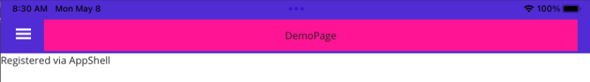
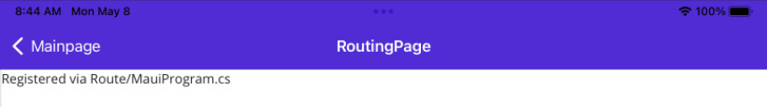
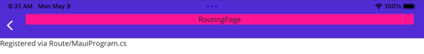

## DemoPage registered in AppShell.xaml
- open via Flyout

## RoutingPage registered in MauProgram.cs

The custom TitleView is shown with a delay after the page transition is finished & has the wrong size

- open via Button on MainPage
  - custom TitleView is missing during transition

- RoutingPage finished loading
  - custom TitleView appears, but has wrong size

